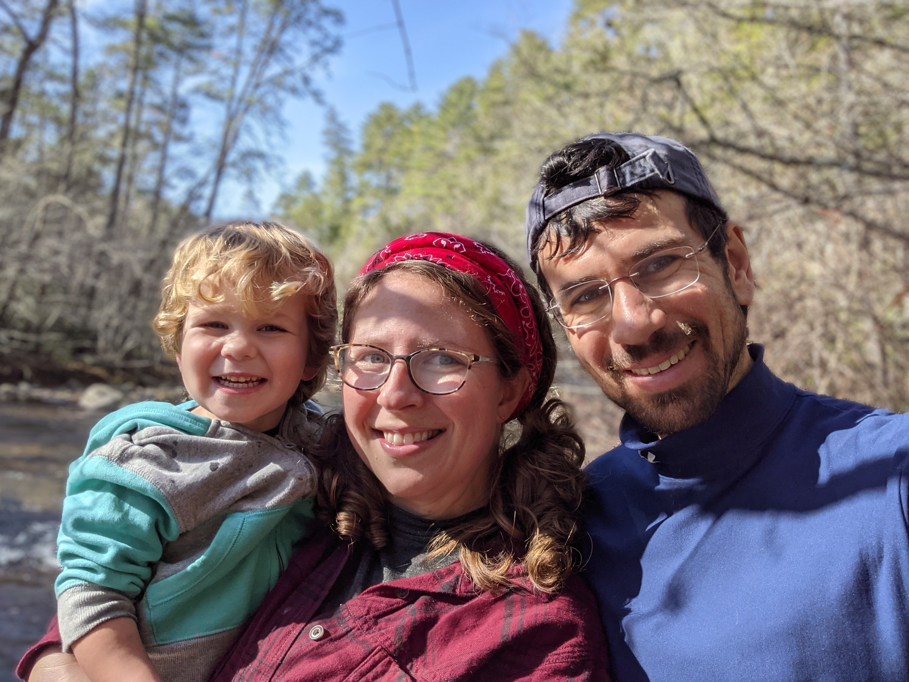

# Why are we writing this book? {#why}

- We have been taking trips for around years
- During the past year, due to COVID, outdoor trips were the main thing we did with our child
- We have done a lot of research, but we are only writing about places we have visited, hiked, paddled, and camped at with our little one
- Its location is really great ([see here](https://recreationlinks.org/wp-content/uploads/2019/03/Outdoor_RecMap-MapSide__2ndEdition_04jul2018.pdf))
- It can be under-rated and hard to learn about

Principles that motivate this book:

- We write about places we go to regularly; in principle, at least twice, and in many cases, many times more than that.
