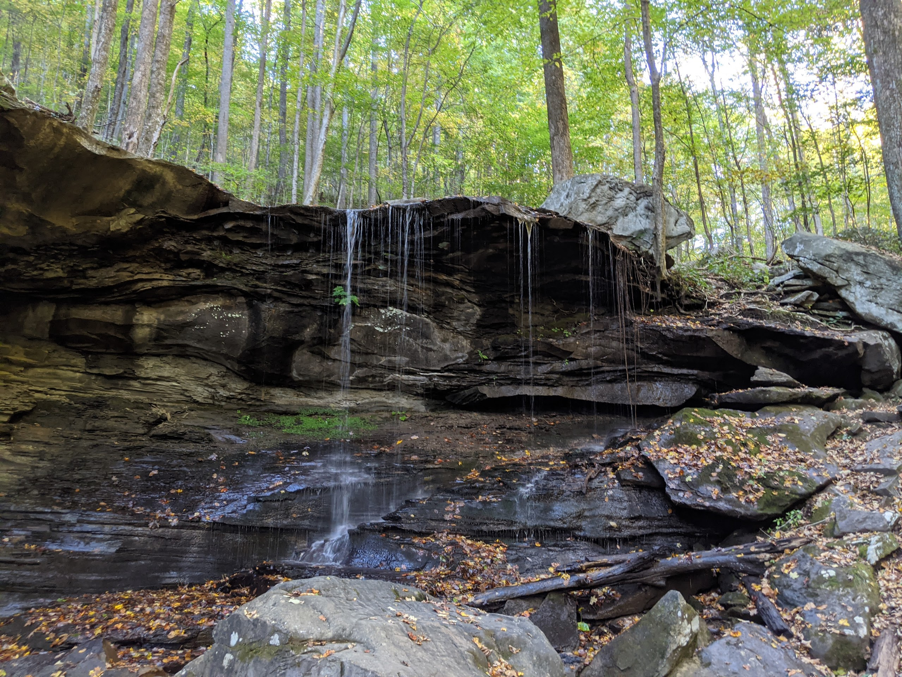

# Emory Falls





## Trail Information

```{r, echo = FALSE, message = FALSE}
library(tidyverse)

d <- read_csv("trail-info.csv")

d %>% filter(str_detect(`Hike Name`, "Emory")) %>% 
    knitr::kable()
```

## Overview

## Map

```{r, fig.cap="Emory Falls Trail Map"}
knitr::include_graphics(here("output", "emory-falls-map.png"))
```

## Trail Description

## Nearby