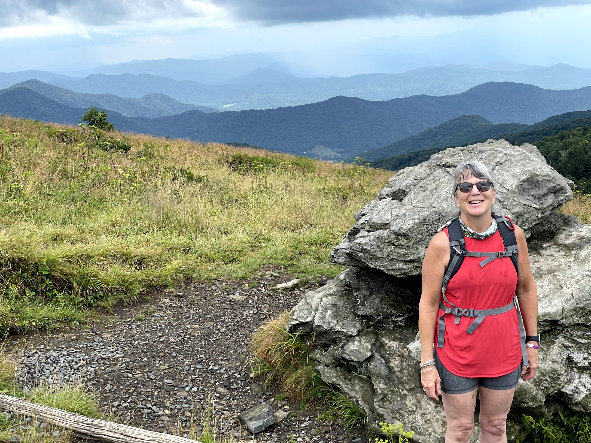
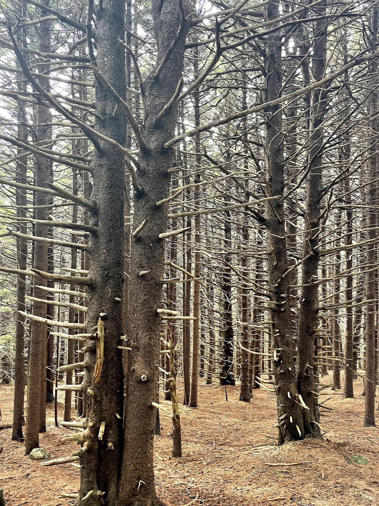
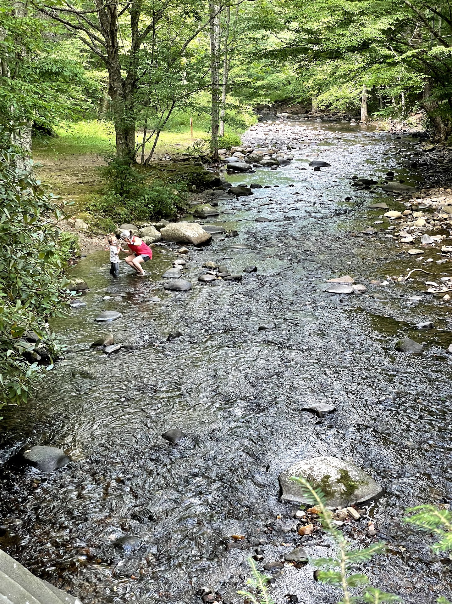

# Roan Mountain





## Trail Information

### Ratings

```{r, echo = FALSE, message = FALSE}
library(tidyverse)

d <- read_csv("trail-info.csv")

dd <- d %>% filter(str_detect(`Hike Name`, "Roan"))

dd %>% 
    select(c(1, 5:8)) %>% 
    knitr::kable()

ddd <- dd %>% janitor::clean_names()
```

### Basic Characteristics

Location: `r dd$Location`  
Region: `r dd$Region`  
Distance: `r ddd$distance_shorter_option` (mi.)  
Elevation (Ascend): `r ddd$ascend_shorter_option`  (ft.)  
Max. Elevation: `r ddd$max_elevation_shorter_option` (ft.)  

## Overview

## Map

```{r, fig.cap="Seven Islands Loop Trail Map"}
knitr::include_graphics(here("output", "seven-islands-loop-map.png"))
```

## Trail Description

## Nearby
