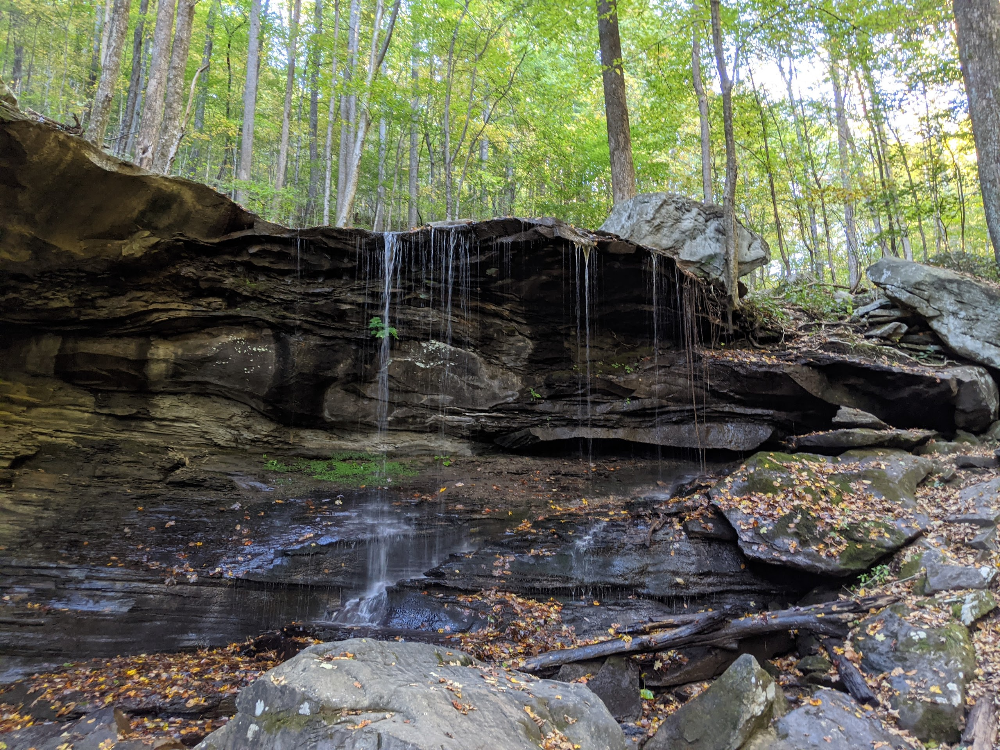
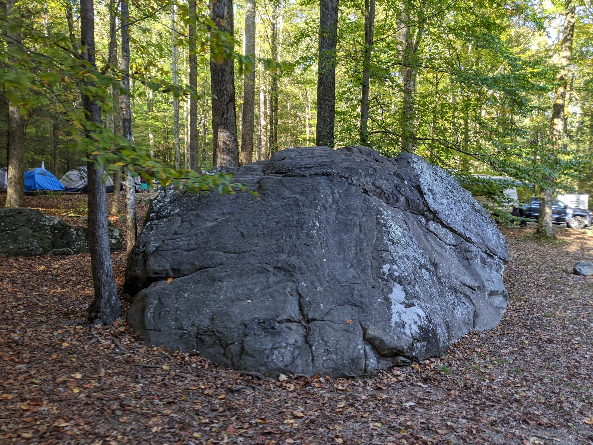

# Frozen Head

## Overview

Transcribed by https://otter.ai

First head, maybe what I think of as the most underrated place in the most underrated place in East Tennessee Cumberland Plateau getting the frozen head adds to this sense of being underrated, in that you drive from Knoxville, through Oak Ridge, and into increasingly rural areas. Just when it starts to feel like you're entering a more outdoorsy girl place your approach the Morgan State Penitentiary, one of the largest prisons in Tennessee. Adding to the slightly strange but also well, it's really not much else it is since that frozen head can break, you have to drive past the State Penitentiary to get to the skate park. Collectively, these aspects of the driving don't let frozen had a sense of the epic or survive, like you get traffic into the Smokies period. There's basically no way to approach the school piece that doesn't feel majestic. Period. Moreover, you typically lose cell service, either as you enter the park or before adding to the sense of the Smokies is remote. It's separate from the rest of the area. FirstNet isn't really like that. It's less than an hour from Knoxville. And I found that many in Knoxville, even those who have been here for a while don't know about it. It has a campground and also a lot of functions for getting outside. Let me focus on the campground for a minute. The camera itself is just perfect. It's hard to describe it other than that. It's small about 20 sites and they do allow trailers but only those below it's like most of the campers most of the time I've been in Frozen sleeping tents, but there are also a number of pop ups and small travel trailers. It's the kind of campground where every site is nice. The sites that seem most immediately appealing are those that are on the right as you drive into the campground. These are the sites that are along the creek. They're large and they overlook a fairly steep drop off down to the water. However, we've mostly stated other sites and they have other aspects that make them desirable. For one there's true ganttic boulders everywhere. This is one thing that makes the Cumberland Plateau different than the Smokies.

For another it's such a small campground and it's laid out in such a way that it always seems safe for children

it's just a great spot to hang out. Moreover, it's close to the playground. Which itself is fine but is made even nicer by a bridge that crosses over the creek as well as easy access to the creek. Collectively, these make camping area just a really great place to hang out with kids, whether overnight or on a day trip. There are two other things about frozen head that make it really good for kids. First, there's a good hike that's just long enough to be interesting. To a waterfall, Emery falls. It's a great, moderately challenging hike that almost always pretty. Second, there's an Riverwalk along the creek below the campground that makes for good short trips. There are also nice scenic trails around some of the trails that lead up to the backcountry sites.

I'll tell one more story about frozen head and that's a time when I took my son late in the day. He let them drive out there and we arrived sometime around 4pm We started hiking on the trail onto the waterfall and almost everyone we saw was heading back toward us as we get farther and on the trail and get quieter and quieter and we said to go past the first of all that had for a second. This is another one of those hikes that had a touch of What makes this smokey special just moments where the landscape changes a little bit, and the lights shining through the trees is just right. And somehow the place seems very different from the rest of the surroundings. For some reason there's something about driving home from frozen head that always sticks with me. I'm not sure why but for whatever reason, the drive home seems more adventurous and majestic than the drive there. Driving to Oak Ridge is nice because you have options for places to stop. Moreover, driving past all of West Knoxville on I 40 on the way home gives you a ton of options for dinner and closer to home. Another thing about frozen heads location is that it's close to a little bit wild and scenic river. And then a few occasions we've combined the frozen head and Obed we'll talk about Obed next

## Camping

Transcribed by https://otter.ai

I'd like to share a few thoughts on frozen head State Park. The first time I went to frozen head was with our neighborhood friends, and their friends and all of our children. There were three kids and three dads when we went. And it was the first time I've gone camping with my son.

When we pulled up, our friends were at the playground by the creek creek that flows through frozen bed. And my son instantly seemed happy to be there. I remember getting out and playing and running back and forth between the campsite and the playground. As we approached the thing, we made dinner, and my son did great play with tractors and with the other kids that time. But as I started to get late, and later, sleep seemed like he was going to be in trouble. After watching cartoons at the turn for around 45 minutes, I said didn't seem any closer to falling asleep. And I was starting to become anxious about what would happen. One point he was insisting on going in the car, ostensibly, because he thought they would help us to get home back to his bed. I obliged for a minute, which maybe was not a good call. But we went into the car and he insisted on sitting in his car seat. Period not looking good. I was feeling close to my wit's end, it was around 11pm. Both of my friends were asleep. We didn't seem anywhere close to falling asleep in the car. I started thinking about what we would need to do the next day to come back to get our stuff. When we drove home. Making it home after midnight. I remember my son asking What a noise was I forget exactly how the conversation unfolded. But he said something like, is that a motorcycle? And I said something like no, I don't think so. And then he said, Ted, and I asked him tent.

And we headed back into the tent. And he promptly fell asleep. This was one of those moments that actually like was big. Maybe in retrospect, a few weeks or months later, we would have had a camping trip and this seemingly important event wouldn't have come on. But it felt like a huge breakthrough for me, for my son and for us.

And that we could have gone home back to his bed. And he could have cried or continued to not fall asleep. And we were really close to him. But we decided to stay and the amount of confidence and joy they gave me was hard to describe
