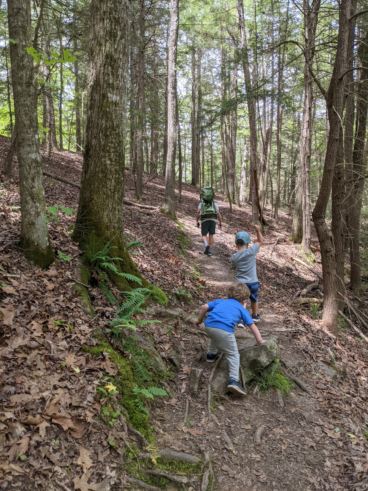

# Obed

Transcribed by https://otter.ai

Obed Wild and Scenic River is a special place. That's becoming a bit of a refrain for me here. But it's one of those places that always does feel a little bit different, a little bit quirky and a little special. I wouldn't ever use the words Corky to describe the Smokies it just doesn't fit. But there's something about the Cumberland Plateau that's distinctly quirky, and weird and wild, especially in its own way, not in the majestic way that the Smokies are. I feel like I can't put into words what makes the color of the planet or the way it is. I think part of it is the terrain, which is very rocky, and very different from both the Smokies and the Tennessee Valley. Another thing about the Cumberland Plateau is that just getting there is always a little bit weird. Whereas driving to the Smokies you pass science and I'm seeing that you're entering a national park. And pretty much regardless of the entrance except for heading to Abrams, you're going to pass businesses that cater toward tourists to the park. Well, also Big Creek, okay, there's many that don't cater to tourists. But entering the park the main ways you will see many signs that you are entering the very large, very busy National Park, the opposite almost always seems to be true for the number of plateau. This is especially the case for Obed, which is kind of commonly hard to find. Once I drove with my son to the point trail, as indicated by Google Maps, it's a great trail and one that I've been to several times before. But Google Maps was just wrong. It took me to the middle of nowhere. And when I got home, I confirm that somehow there were two locations for the point trail and one of them wasn't close to the other. I actually ended up finding the point trail on that trip but added about 30 minutes of driving it was super stressful, because in that area, there was a GPS or cell signal. I ended up submitting an edit to Google Maps. I'm not sure it ever got made. If a project frozen had feels a little bit quirky, driving into a rural area and then passed the state penitentiary driving to Obed just always gives you the sense that there couldn't possibly be something managed by the National Park Service here. It's just very rural, and again, weird and quirky. And on occasion I pass things that make me uncomfortable, like Confederate flags, and signs of abject poverty. Although I'm not sure that makes me uncomfortable so much. It's just gives me a sense that this is somewhere that's different from somewhere where people live their lives in a very different way than when you approach overhead, you'll cross a bridge, which according to a guide that I've read used to be a party spot for area kids. Now it has been tables and looks like somewhere managed by the National Park Service. Even heading over the bridge, it's not really apparent that you're headed to a trailhead it just kind of looks like he drove past the river and now you're heading back into another quasi rural area. But about a mile past the river is a trailhead to the point Trail, which is one of those trails that always seems to be associated with good memories. The correlation and causation is difficult, difficult to disentangle when it comes to trips with family and friends. Is it that we selected to go to these places on beautiful days when we're feeling ready to go hiking in the rainy or cloudy or too cool days are the days on which we didn't feel great. Did you just stay home? Question mark. I don't think that's strictly the case because there have been many days where we have been outside when it's cold, quite cold, or when we get rained on or when our move just isn't quite right. But still in all of those cases. These areas seem to be providing a table that if one is open to it, can open can give one's problems can provide the medicine that in any case. I'm going to speak first about a year. We took his family COVID It was a beautiful spring day and we headed out on the trail which will first cross head down into well First, you can head out to the overlook, which is gorgeous. I think it's one of the prettiest overlooks in the area, and that the obit just looks mild and rustic and very hard to access all things that are. After the overlook you head down to the valley, where you cross a bridge covering, crossing a creek with a lot of Magnolia I'm sorry, a lot of rhododendron all around, it feels very tropical and wet. You then head up past a lot of trees that are very emblematic of this like the Bigleaf magnolia. These are trees that shed their leaves in Pepin fashion in the fall. According to many tree guides, they are the trees with the largest deciduous leaves. After you head up from the Creek Valley, you had to rocky area with boulders all around and then a fairly large rock face in front of you. The rock face looks semi amenable to climbing but of course, the trail doesn't go up, and there is a pathway around it. And then up to the top of the rock face, behind which the entire type of environment seems to change again to qualify open Ridge walk. Heading up to the point. This part of the trail is really lovely. And in some ways. What makes this show special is the variety overlook the creek in the rocky area, the ridge walk this area, this hike leads out to the intersection with another trail. And at this point, the environment seems to change and the soil becomes really sad. And you notice that you are sitting on a ridge line with fairly steep drop offs on either side. After a short distance, you approach a covered rocky area, which makes it a good place to stack. Continuum. Another word for somewhere around half a mile is the end of the trail and a nice overlook. But I don't think it's necessarily nicer or more than that we're looking at the beginning of the make or the cool rock shelter. And indeed, it's just a bit far for shorter hiking with family and kiddos. On the day that we went out to bed for the first time, or son fell asleep on the way back in my arms or something it took me I did a period across the ridge. I'll pass the rock area over the bridge and the backup to the parking area where we headed through the parking lot and down toward the boulder. He continued sleeping and it was just one of those perfect moments. The weather was great. It was rested. We were happy after he finally woke up and we headed to a brewery nearby. And that too was about as diplomatic as the obits weirdness as as possible. seemed less like a brewery and more like someone's house that happened to sell beer that they made there. That was really good. Yeah, they also had food which shared the same quality. It wasn't really clear even what the menu was they were just sort of making food and you were sort of placing orders by this point pretty hot in the day and we ended up with a slightly creepy toddler. But it was still a great trip and a great way to have a great night.
